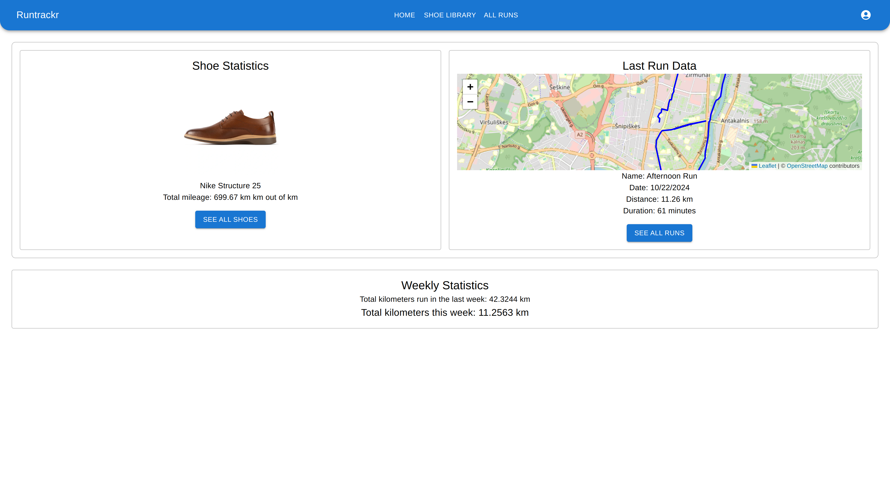
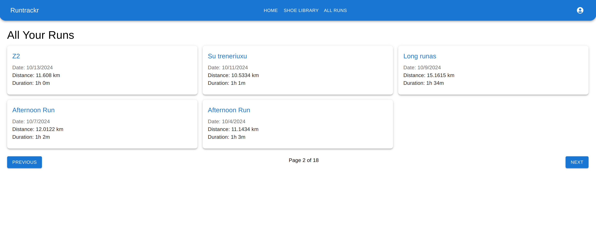

<!-- PROJECT LOGO -->

<h3 align="center"> RunTrackr </h3>

  

    StravaAPI | Full-stack | Responsive
     
     
    <a href="paste link here">View Demo</a>
    ·
    <a href="https://github.com/shpokas-io/runtrackr-webapp/issues">Report Bug</a>
    ·
    <a href="https://github.com/shpokas-io/runtrackr-webapp/issues">Request Feature</a>
  

<!-- TABLE OF CONTENTS -->

  
Table of Contents

  <ol>
    <li>
      <a href="#about-the-project">About The Project</a>
      <ul>
        <li><a href="#built-with">Built With</a></li>
      </ul>
    </li>
    <li>
      <a href="#installation">Installation</a>
    </li>
    </li>
    <li><a href="#contact">Contact</a></li>
    <li>
      <a href="#left-to-do">Left To Do</a>
    </li>
    <li>
      <a href="#tought-process">Tought Process</a>
    </li>
  </ol>

<!-- ABOUT THE PROJECT -->

## About The Project

RunTrackr is for personal use to track my weekly runs and manage my gear.  The app keeps a record of my last runs, displays all my Strava runs on a separate page, and includes a shoe library to select from.  It's a straightforward tool designed to enhance my running experience.

- Weekly run tracking.
- Last Runs Overview.
- Strava integration.
- Shoe library (🏗️).
- User-Friendly Interface(🏗️).

 

(<a href="#readme-top">back to top</a>)

### Built With

##### Back end

- ![Node.js][Node.js]
- ![Express][Express]

##### Front end

- ![React][React]
- ![Material-UI][Material-UI]
- ![Vite]
- ![NPM][NPM]

(<a href="#readme-top">back to top</a>)

### Installation

##### Backend Setup

🏗️

##### Frontend setup

🏗️

#### Tought Process

🏗️

## Contact

Skirmantas Spakovskis - [@LinkedIn](https://www.linkedin.com/in/skirmantasspakovskis/) - skirm.spak@gmail.com

(<a href="#readme-top">back to top</a>)

<!-- MARKDOWN LINKS & IMAGES -->
<!-- https://www.markdownguide.org/basic-syntax/#reference-style-links. -->

[NPM]: https://img.shields.io/badge/NPM-%23000000.svg?style=for-the-badge&logo=npm&logoColor=white
[Webpack]: https://img.shields.io/badge/webpack-%238DD6F9.svg?style=for-the-badge&logo=webpack&logoColor=black
[Vite]: https://img.shields.io/badge/Vite-B73BFE?style=for-the-badge&logo=vite&logoColor=FFD62E
[JavaScript]: https://img.shields.io/badge/javascript-%23323330.svg?style=for-the-badge&logo=javascript&logoColor=%23F7DF1E
[React]: https://img.shields.io/badge/React-%2361DAFB.svg?style=for-the-badge&logo=react&logoColor=white
[HTML5]: https://img.shields.io/badge/html5-%23E34F26.svg?style=for-the-badge&logo=html5&logoColor=white
[CSS3]: https://img.shields.io/badge/css3-%231572B6.svg?style=for-the-badge&logo=css3&logoColor=white
[Parcel]: https://img.shields.io/badge/Parcel-%23B93C00.svg?style=for-the-badge&logo=parcel&logoColor=white
[SCSS]: https://img.shields.io/badge/SCSS-%23CC6699.svg?style=for-the-badge&logo=sass&logoColor=white
[Webpack]: https://img.shields.io/badge/Webpack-8DD6F9?style=for-the-badge&logo=webpack&logoColor=white
[ASP.NET Core]: https://img.shields.io/badge/ASP.NET%20Core-%230078D7.svg?style=for-the-badge&logo=aspnetcore&logoColor=white
[Tailwind CSS]: https://img.shields.io/badge/Tailwind%20CSS-%2338B2AC.svg?style=for-the-badge&logo=tailwindcss&logoColor=white
[Entity Framework Core]: https://img.shields.io/badge/Entity%20Framework%20Core-%23094E9C.svg?style=for-the-badge&logo=dotnet&logoColor=white
[Node.js]: https://img.shields.io/badge/Node.js-339933?style=for-the-badge&logo=nodedotjs&logoColor=white
[Express]: https://img.shields.io/badge/Express-000000?style=for-the-badge&logo=express&logoColor=white
[Material-UI]: https://img.shields.io/badge/Material%20UI-007FFF?style=for-the-badge&logo=mui&logoColor=white
[product-screenshot]: public/images/prev.png
